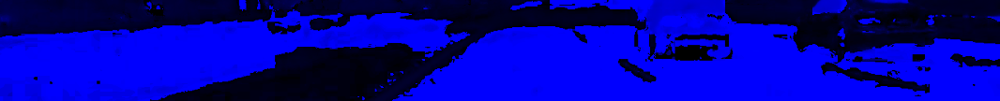
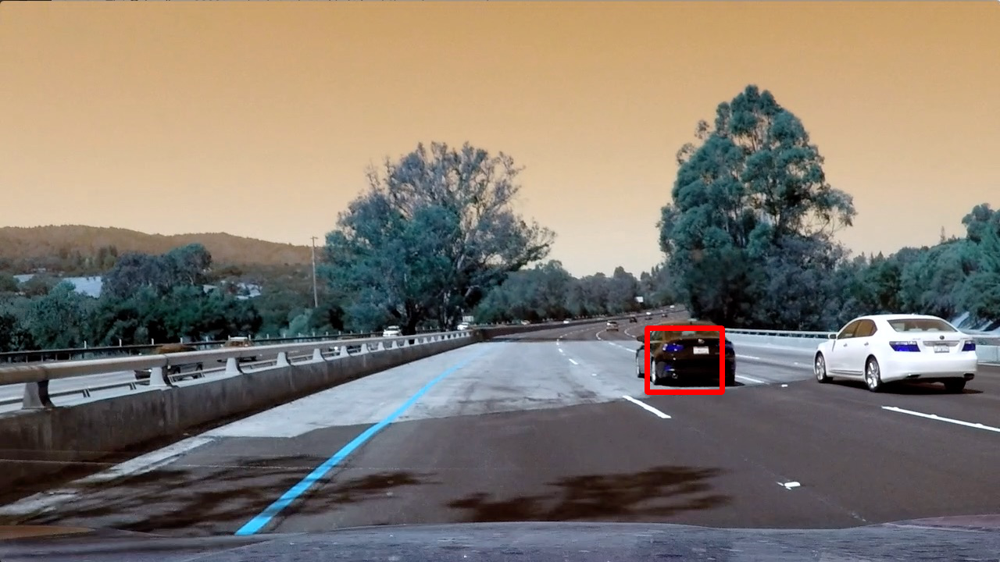
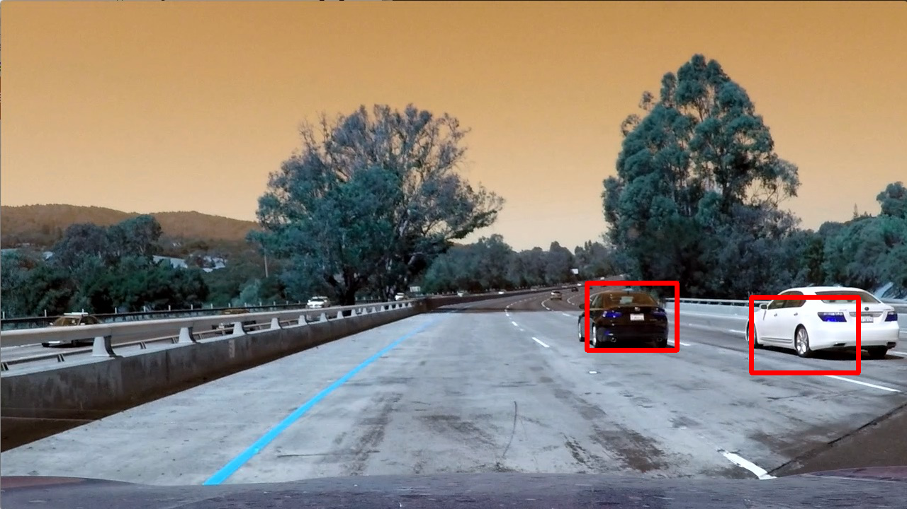
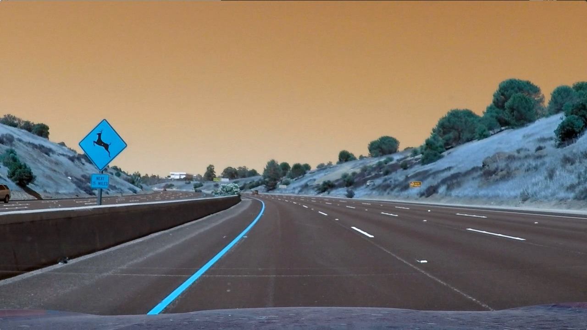

## Writeup Template
### You can use this file as a template for your writeup if you want to submit it as a markdown file, but feel free to use some other method and submit a pdf if you prefer.

---

**Vehicle Detection Project**

The goals / steps of this project are the following:

* Perform a Histogram of Oriented Gradients (HOG) feature extraction on a labeled training set of images and train a classifier Linear SVM classifier
* Optionally, you can also apply a color transform and append binned color features, as well as histograms of color, to your HOG feature vector.
* Note: for those first two steps don't forget to normalize your features and randomize a selection for training and testing.
* Implement a sliding-window technique and use your trained classifier to search for vehicles in images.
* Run your pipeline on a video stream (start with the test_video.mp4 and later implement on full project_video.mp4) and create a heat map of recurring detections frame by frame to reject outliers and follow detected vehicles.
* Estimate a bounding box for vehicles detected.

[//]: # (Image References)
[image1]: ./examples/car_not_car.png
[image2]: ./examples/HOG_example.jpg
[image3]: ./examples/sliding_windows.jpg
[image4]: ./examples/sliding_window.jpg
[image5]: ./examples/bboxes_and_heat.png
[image6]: ./examples/labels_map.png
[image7]: ./examples/output_bboxes.png
[video1]: ./project_video.mp4

## [Rubric](https://review.udacity.com/#!/rubrics/513/view) Points
### Here I will consider the rubric points individually and describe how I addressed each point in my implementation.

---
### Writeup / README

#### 1. Provide a Writeup / README that includes all the rubric points and how you addressed each one.  You can submit your writeup as markdown or pdf.  [Here](https://github.com/udacity/CarND-Vehicle-Detection/blob/master/writeup_template.md) is a template writeup for this project you can use as a guide and a starting point.

You're reading it!

### Histogram of Oriented Gradients (HOG)

#### 1. Explain how (and identify where in your code) you extracted HOG features from the training images.

I started by reading in all the `vehicle` and `non-vehicle` images.  Here is an example of one of each of the `vehicle` and `non-vehicle` classes:


I then explored different color spaces and different `skimage.hog()` parameters (`orientations`, `pixels_per_cell`, and `cells_per_block`).  I grabbed random images from each of the two classes and displayed them to get a feel for what the `skimage.hog()` output looks like.

Here is an example using optimized parameters (see section below) for a car and noncar input.


*Car*


*Not car*

The code for HOG can be found in lesson_func.py `get_hog_features` and `single_img_features`.

#### 2. Explain how you settled on your final choice of HOG parameters.

To identify the best parameters for the HOG features, I utilized `RandomizedSearchCV` in scikit learn to search for best the best peforming parameters for over a few hundred images from car and non-car class. This can be found in vehicle.py `search` function.

After the experiment, I obtained the following parameters:
```
{"hog__hist_bins": 16, "hog__cell_per_block": 4, "hog__spatial_size": 8, "hog__orient": 10, "hog__pix_per_cell": 8, "hog__color_space": "HLS"}
```

#### 3. Describe how (and identify where in your code) you trained a classifier using your selected HOG features (and color features if you used them).

I trained a linear SVM as demonstrated in the lesson and the code can be found in vehicle.py under `train` function.

For the detailed HOG parameters used, see the previous section. I was able to obtain test set accuracy of 98%.

The trained model is saved in `svc.pickle`. The model can be retrained from scratch by running `./vehicle.py train`;

### Sliding Window Search

#### 1. Describe how (and identify where in your code) you implemented a sliding window search.  How did you decide what scales to search and how much to overlap windows?

The sliding window search paramters can be found in `./search_params.json`. The actual function is adapted from the lesson and can be found in hog_sample.py.

The bottom half the image is divided into multiple thin slices and a 64 by 64 pixel sliding window is sweeped across using overlap of 3 pixels. This strategy is obtained through trial and error while optimizing for speed of frame analysis as well as heuristically estimating the size of the vehicles in different y positions in the image.

Given input image


The generated slices where the alogrithm sweeps for vehicle detection look like the following in HLS colorspace (the one found by random search to be best performing):





#### 2. Show some examples of test images to demonstrate how your pipeline is working.  What did you do to optimize the performance of your classifier?

Using the search parameters in `search_params.json` (visualized in the previous section), here is an example of the output for the test images.







In order to optimize the performance, searching across the different horizontal slices are done in parallel using the `deco` multiprocessing library.

---

### Video Implementation

#### 1. Provide a link to your final video output.  Your pipeline should perform reasonably well on the entire project video (somewhat wobbly or unstable bounding boxes are ok as long as you are identifying the vehicles most of the time with minimal false positives.)
Here's a [link to my video result](./test_videos_output/project_video.mp4)


#### 2. Describe how (and identify where in your code) you implemented some kind of filter for false positives and some method for combining overlapping bounding boxes.

I recorded the positions of positive detections in each frame of the video. From the positive detections I created a heatmap and then thresholded that map to identify vehicle positions.  I then used `scipy.ndimage.measurements.label()` to identify individual blobs in the heatmap.  I then assumed each blob corresponded to a vehicle.  I constructed bounding boxes to cover the area of each blob detected.

Additionally, using the assumption that vehicles move relatively slowly in each frame, I retain heatmap values over 8 frames and exponentially decrease the effect of the older frames (see line 188 in pipe.py) as well as threshold the final heatmap using the 97 percentile value.

Here's an example result showing the heatmap from a frames of video and before and after heatmap thresholding


*Before*


*After*

---
### Discussion

#### 1. Briefly discuss any problems / issues you faced in your implementation of this project.  Where will your pipeline likely fail?  What could you do to make it more robust?

The major issue faced in completing this assignment is the performance of the frame analysis. Initially, I was searching across the entire frame and generating HOG features in each sliding window as initial proof of concept but the performance was too slow to do effective trial and error on what sliding window approach worked best. Following the lecture suggestions, I was able to adapt the HOG sampling function to obtain good performance along with multiprocessing module in python.

Another issue faced was the thresholding logic of the heatmap. Through trial and error, I concluded a constant threshold number is not robust enough and found percentile over the heatmap value worked well.

The current pipeline works well in the sample video but will most likely fail in more challenging environment where rain, snow, etc. obstruct the vehicle. Additionally, the classifier is trained on the rear view of the vehicle so cannot be adapted for the shoulder check mirror or side mirror vehicle detection. Similarly, it is important to benchmark vehicle detection right under different lighting conditions to make sure the system continues to work with headlights, sunlights, effects etc.

In order to make the whole pipeline more robust, applying CNN deep learning neural nets should reduce false positives while reducing the need for sliding window search; this will also help increase frame analysis performance.
